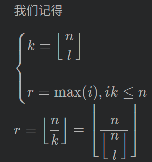
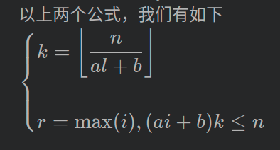

[TOC]
# 数论分块

## 目录 <!-- omit in toc -->
- [数论分块](#数论分块)
  - [整数分块](#整数分块)
    - [整除分块r的推导的一般方法：](#整除分块r的推导的一般方法)
      - [推导r:](#推导r)

## 整数分块
以$\sqrt(n)$的复杂度计算类似$\sum_{i=1}^{n}⌊\frac{n}{i}⌋$
因为中间很多值是一样或可以用公式计算出来其连续运算的值。

```cpp
ans = 0;
for(int l = 1, r; l <= n; l = r + 1){
    r = n / (n / l);
    ans += n / l * (r - l + 1);
}
```
### 整除分块r的推导的一般方法：
已知正整数n,a,b,求$\sum_{i=1}^n\lfloor \frac{n}{ai+b} \rfloor$
#### 推导r:

写出等式与不等式，算出的最大i,即可算出每次的右边界。

