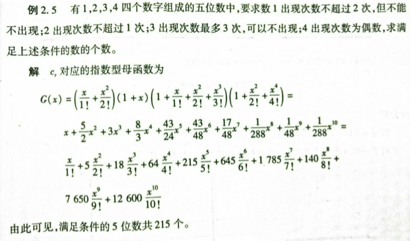

[TOC]
# 数论

## 带模的快速乘
```cpp
inline ll qmult(ll a, ll b, ll mod){
	ll ans = 0;
	while( b > 0 ){
		if( b&1 ) ans = (ans + a) % mod;
		a = ( a + a ) % mod;
		b >>= 1;
	}
	return ans;
}
```

## 带模的快速幂

```c
ll binaryPow(ll a,ll b,ll m){
	ll ans = 1;
    while(b){
        if(b & 1){
            ans = ans * a % m;
        }
        a = a * a % m;
        b >>= 1; 
    } 
    return ans;
}
```

## 矩阵快速幂
```c
const int MAXN=2;
const int MOD=1e4;
class Matrix{
public:
	int m[MAXN][MAXN];
	Matrix(){
		memset(m,0,sizeof(m));
	}
};
Matrix Multi(Matrix a,Matrix b){
	Matrix res;
	for(int i=0;i<MAXN;i++){
		for(int j=0;j<MAXN;j++){
			for(int k=0;k<MAXN;k++){
				res.m[i][j]=(res.m[i][j]+a.m[i][k]*b.m[k][j])%MOD;//取模 
			}
		}
	}
	return res;
}
Matrix fastm(Matrix a,ll n){
	Matrix res;
	for(int i=0;i<MAXN;i++){
		res.m[i][i]=1;
	}
	while(n){
		if(n&1){
			res=Multi(res,a);
		}
		a=Multi(a,a);
		n>>=1;
	}
	return res;
}
```

## 斐波那契矩阵算法：

## 斐波那契通项公式
$f(n)=\frac{ (\frac{1+\sqrt{5}}{2})^n-(\frac{1-\sqrt{5}}{2} )^n }{\sqrt{5}} $

## 因子分解
```c
int fac[MAXN+10],cnt[MAXN+10];
int getFac(int n){
    int num=0,sum=0,m=sqrt(n+0.5);
    for(int k=2;k<=m;k++){
        sum=0;
        while(n%k==0){
            n/=k;sum++;
        }
        if(sum!=0){
            fac[num]=k;cnt[num++]=sum;
        }
    }
    if(n!=1){
        fac[num]=n;
        cnt[num++]=1;
    }
    return num;//返回的是因子个数；
}
```
优化：用素数除
### 唯一分解定理
  对于任意一个正整数n，一定可以被唯一分解为若干个质数的乘积的形式：$n = {p_1}^{a_1} *{p_2}^{a_2} * … * {p_k}^{a_k}$。

### 因子分解扩展

#### 因子个数 
正整数n的所有不同因子的总个数。
计算公式：D = (a1+1) x (a2+1) x … x (ak+1)。
#### 因子求和

正整数n的所有不同因子的总和。
计算公式：$S = \prod_{i=1}^k[ 1 +p_1+ {+p_2}^2 + … + {p_i}^{ai} ]$
等比数列求和式改写：S = Π[ (pi^(ai+1)-1)/(pi-1) ]


#### 阶乘的因子分解
&ensp;给定正整数n，求n!的因子分解式中质因子p的数量，可以用以下公式求解：
S(p)=求和\[(n/p+n/(p^2)+n/(p^3)+…+n/(p^k)\]，其中 p^k<=n，时间复杂度为O(log(n))。

## GCD与LCM

补充一点：求解gcd问题可以使用两种方法：更相减损法和辗转相除法（欧几里得算法）但是在遇到高精度取模的问题时，可考虑使用更相减损来代替。

更相减损法模板：（认为a > b)

```cpp
int gcd(int a,int b)
{
    if(b == 0) return a;
    else return gcd(b,a - b);
}
```


```c
int gcd(int a,int b){
    return b==0?a:gcd(b,a%b);
}

int lcm(int a,int b){
    return a/gcd(a,b)*b;
}
```
### 关于GCD的一些常用的性质：

(1.结合律) GCD(a,b,c)=GCD(GCD(a,b),c)。
(2.区间) GCD(al,…,ar)=GCD(GCD(al,…,am-1),GCD(am,…,ar))。
(3.分配律) GCD(k*a,k*b)=k*GCD(a,b)。
(4.互质) 若GCD(a,b)=p，则a/p与b/p互质。
(5.线性变换) GCD(a+k*b,b)=GCD(a,b)。
(6.因子分解) GCD(a,b)=Π[pi^min(ai,bi)]。

### 最大公因数

(1.结合律) LCM(a,b,c)=LCM(LCM(a,b),c)。
(2.分配律) LCM(k*a,k*b)=k*LCM(a,b)。
(3.因子分解) LCM(a,b)=Π[pi^max(ai,bi)]。

##  欧拉函数
### 计算方法：
φ(n) = Π[ pi^(ai-1) ] x Π[ pi-1 ]。
通式：
```c
//求一个数的欧拉函数
ll euler(ll x){
  ll ans=x;//最终答案
  for(ll i=2; i*i<=x; i++){
    if(x%i==0)////找到a的质因数
    {
      ans=ans/i*(i-1);//先进行除法是为了防止中间数据的溢出
      while(x%i==0) x/=i;//x通过质因子分解  x/=i 质因数
    }
  }
  if(x>1) ans=ans/x*(x-1);
  return ans;
}

```
### 性质 
1. 对任意正奇数n，φ(n)=φ(2*n)，特别规定φ(1)=1。
2. 对任意质数n，φ(n)=n-1，φ(n^ k)=(n-1)*n^(k-1)。
3. 对于正整数n的所有因子di，有Σ[φ(di)]=n。


## 扩展欧几里德算法与二元一次方程的整数解

### 拓展欧几里德算法
```cpp
int exgcd(int a,int b,int &x,int &y){
	if(a==0&&b==0)return -1;
	if(b==0){
		x=1;y=0;
		return a;
	}
	int ans=exgcd(b,a%b,y,x);
	y-=a/b*x;
	return ans;
}
```
&ensp;&ensp;变量x和y中存储了方程a*x+b*y=gcd(a,b)的一组整数解;
&ensp;&ensp;函数的返回值是gcd(a,b)，若返回-1，则无解;


## 逆元
### 求逆元
#### 费马小定理求逆元

费马小定理: p为质数,a为任意自然数,且a，p互质,则

所以

&ensp;&ensp;将$a^{p-1}$ 拆成$a^{p-2} *a$。$a^{p-2}$就是a的逆元快速幂求逆元;
&ensp;&ensp;要求mod是质数且与a互质
&ensp;&ensp;时间复杂度$O(logn)$

####  欧拉定理 
* 欧拉定理：若a和p互质，则$ a^{φ(p)}mod\, p=1 $。
* 所以逆元：$inv(a)=a^{φ(p)-1} mod\,p $。
* 计算过程首先需要求出欧拉函数，然后使用快速幂优化

(只要求a与mod互质，需要欧拉函数与快速幂)

#### 线性打表求逆元
条件:互质
```cpp
const int MAXN=1e5;
const ll  mod=1e9+7;
ll inv[Maxn+10];
void getInv(){
	inv[1]=1;
	for(ll i=2;i<=MAXN;i++){
		inv[i]=(mod-mod/i)*inv[mod%i]%mod;
	}
	return ;
}
```
复杂度O(n)
#### 扩展欧几里德求逆元
&ensp;&ensp;即求解同余方程 $a*x≡1(mod\,m)$求x,要求a，m互质

#### 通用方法处理除法
条件b|a
$\frac{a}{b} mod \,p=\frac{a\,mod(b*p)}{b}$

## 拓展欧几里德 
&ensp;&ensp;只要求a与mod互质，时间复杂度O(log(n)))

### 扩展欧几里得解线性方程a*x+b*y=c

&ensp;&ensp;线性方程有解的充分必要条件是gcd(a,b)可以整除c。

```c
bool LinearEqu(int a,int b,int c,int &x,int &y){
	int d=exgcd(a,b,x,y);
	if(c%d==0){
		int k=c/d;x*=k;y*=k;
		return true;//有解
	}
	return false;//无解
	//返回一组解，可能为负
}
```
&ensp;&ensp;通解的求法：若(x0,y0)是线性方程a*x+b*y=c的一组特解，那么对于任意的整数t:
&ensp;&ensp;x=x0+(b/gcd(a,b))*t,y=y0-(a/gcd(a,b))*t都是线性方程的解。

### 拓展欧几里德求解同余方程a*x≡b(mod m)。
```c
bool ModularEqu(int a,int b,int m,int &x0){
    int x,y,k;
    int d=exgcd(a,m,x,y);
    if(b%d==0){
        x0=x*(b/d)%m;k=m/d;x0=(x0%k+k)%k;
        return true;
    }
    return false;
}
```
解法：首先将方程改写为a*x-n*y=b的形式，然后使用拓展欧几里德求出一组特解(x0,y0)。
如果题目要求找到最小的正整数解，可以令k=n/gcd(a,n)，这样x的最小正整数解可以通过表达式x=(x0%k+k)%k求出。

## 中国剩余定理
* 中国剩余定理：设正整数N满足线性同余方程组N≡ai(mod pi)，其中 1<=i<=n，pi两两互质，则$N=Σ[ai * Wi * inv(Wi,pi)]\%M$。
其中，$M=Πpi=p1 * p2 * …… * pn$，$Wi=M/pi$，$inv(Wi,pi)$表示Wi在模pi下的逆元。

* 特别注意：这里的模pi必须两两互质。


* 例子：现在有n个苹果，如果3个苹果装一箱会剩1个，5个苹果装一箱会剩2个，7个苹果装一箱会剩3个。问总共有多少个苹果?
* 解法：首先改写为方程组{ n%3=1 , n%5=2, n%7=3 }的形式。
计算M=3x5x7=105，W1=105/3=35，W2=105/5=21，W3=105/7=15。
求逆元inv(35,3)=2，inv(21,5)=1，inv(15,7)=1。
* 计算n=((1x35x2)+(2x21x1)+(3x15x1))%105=157%105=52。
所以总共有52个苹果。

### 模互质的情况
```cpp
//N 方程个数
int N,pp=1;
int exgcd(int a,int b,int &x,int &y);
int inv(int n,int m){
    int x,y,d=exgcd(n,m,x,y);
    return (x%m+m)%m;
}
//解N≡ai(mod pi)
int China(int p[],int a[]){
    int ans=0;
    for(int i=0;i<N;i++)pp*=p[i];
    for(int i=0;i<N;i++){
        int W=pp/p[i];
        ans=(ans+a[i]*W*inv(W,p[i]))%pp;
    }
    return (pp+ans%pp)%pp;//返回满足条件的最小整数解
}

```
### 模不互质的情况
```cpp
// ai余数 mi 模数  n方程个数[1，n] 
ll excrt(ll ai[],ll mi[],int n){
    ll x,y,k;
    ll M=ai[1],ans=mi[1];
    for(int i=2;i<=n;i++){
        ll a=M,b=ai[i],c=(mi[i]-ans%b+b)%b;
        ll gcd=exgcd(a,b,x,y),bg=b/gcd;//要用到扩展欧几里德
        if(c%gcd!=0) return -1; //无解 因为答案可以等于-1，所以可用falg判断有无解 
        x=qmult(x,c/gcd,bg);//有溢出风险要用到快速乘
        ans+=x*M;
        M*=bg;//M为前k个模数的lcm
        ans=(ans%M+M)%M;
    }
    return (ans%M+M)%M;
}
```

## 素数

### 一些定理
素数定理：不超过x的质数的总数π(x)近似于x/ln(x)。
推论：第n个素数的大小：O(nlog(n))
素数的间隔：相邻两个质数的差值非常小，估算在ln^2 (x)以内。
(其他 1) 在10^7的范围以内，质数的个数为664579个。
(其他 2) 1e9范围内相邻两个质数的最大间隔只有282。
(其他 3) 所有除2以外的正偶数都是合数。
(其他 4) 所有除2以外的质数个位数字都是1、3、7、9。

### 素数分布


### 筛质数

#### 埃氏筛法筛素数
```cpp
int primes[1005];//素数数组
bool is_prime[Maxn];//1是素数0是合数
void sieve(int n){
	for(int i=0;i<=n;i++) is_prime[i]=true;//可能会慢
	is_prime[0]=is_prime[1]=false;
	for(int i=2;i*i<=n;i++){
		if(is_prime[i]){
			for(int j=i*i;j<=n;j+=i){
				is_prime[j]=0;
			}		
		}
	}//标记
	
	return ;
}
```

#### 线性筛

```cpp
const int MAXN=2e6+10;
int primes[MAXN+10],NUM=0;
bool is_prime[MAXN+10];
void GetPrime2(){
    memset(is_prime, true, sizeof(is_prime));
    is_prime[1] = 0;
    for (int i = 2; i <= MAXN; i++) {
        if (is_prime[i])
            primes[NUM++] = i;
        for (int j = 0; j < NUM && i * primes[j] <= MAXN; j++) {
            is_prime[i * primes[j]] = 0;
            if (i % primes[j] == 0)
                break;
        }
    }
}
```

### Miller Rabinn 素数测试

* 用Miller Rabin快速判断一个
<$2^{63}$的数是不是素数。
的数是不是素数
* $时间复杂度：O(k*log_2 n) $
  
#### 依据
* 费马小定理：若p是质数，a为整数，且（a，p）=1,则有 $a^{p-1}\equiv 1(modp)$
* 二次探测定理：若p是质数，且$0<x<p$则方程$x^2\equiv 1(modp)$的解为$x=1,或者x=p-1$
### 模板
```cpp
typedef unsigned long long ll;
//typedef long long ll;
//ll*ll可能会溢出，所以乘法化加法
/* *************************************************
* Miller_Rabin 算法进行素数测试
* 速度快可以判断一个 < 2^63 的数是不是素数
*
**************************************************/
#include<time.h>
#include<stdlib.h>
const int S = 8; //随机算法判定次数一般 8～10 就够了
// 计算 ret = (a*b)%c a,b,c < 2^63
ll mult_mod(ll a,ll b,ll c){
    a%=c;
    b%=c;
    ll ret=0;
    ll tmp=a;
    while(b){
        if(b&1){
            ret+=tmp;
            if(ret>c)ret-=c;//直接取模慢得多 
        }
        tmp<<=1;
        if(tmp>c)tmp-=c;
        b>>=1;
    }
    return ret;
}
// 计算 ret = (a^n)%mod
ll pow_mod(ll a,ll n,ll mod){
    ll ret=1;
    ll tmp=a%mod;
    while(n){
        if(n&1)ret=mult_mod(ret,tmp,mod);
        tmp=mult_mod(tmp,tmp,mod);
        n>>=1;
    }
    return ret;
}
// 通过 a^(n-1)=1(modn)来判断 n 是不是素数
// n - 1 = x * (2^t)
// 中间使用二次判断
// 是合数返回 true, 不一定是合数返回 false
bool check(ll a,ll n,ll x,ll t){
    ll ret = pow_mod(a,x,n);
    ll last = ret;
    for(int i = 1;i <= t;i++){
        ret = mult_mod(ret,ret,n);
        if(ret == 1 && last != 1 && last != n-1)return true;//合数
        last = ret;
    }
    if(ret != 1)return true; // 费马小定理
    else return false;
}
//**************************************************
// Miller_Rabin 算法
// 是素数返回 true,(可能是伪素数)
// 不是素数返回 false
//**************************************************
bool Miller_Rabin(ll n){
    if( n < 2)return false;
    if( n == 2)return true;
    if( (n&1) == 0)return false;//偶数
    ll x = n - 1;
    ll t = 0;
    while( (x&1)==0 ){x >>= 1; t++;}

    srand(time(NULL));/* *************** */

    for(int i = 0;i < S;i++){
        ll a = rand()%(n-1) + 1;
        if( check(a,n,x,t) )
            return false;
    }
    return true;
}

```
### Pollard-Rho算法
```cpp
#include<iostream>
#include<cstdio>
#include<iomanip>
#include<algorithm>
#include<cstring>
#include<cstdlib>
#include<ctime>
#include<queue>
#include<vector>
#include<stack>
#include<map>
#include<set>
#define ull unsigned long long
#define lb long double
#define ll long long
#define debug(x) cout<<"###"<<x<<"###"<<endl;
using namespace std;
inline ll Abs(ll x){return x<0?-x:x;}//取绝对值
inline ll gcd(ll x,ll y){//非递归求gcd
    ll z;
    while(y){z=x;x=y;y=z%y;}
    return x;
}
inline ll qMult(ull x,ull y,ll p){//O(1)快速乘（防爆long long）
    return (x*y-(ull)((lb)x/p*y)*p+p)%p;
}
inline ll qPow(ll x,ll y,ll p){//快速幂
    ll res=1;
    while(y){
        if(y&1)res=qMult(res,x,p);
        x=qMult(x,x,p); y>>=1;
    }return res;
}
inline bool Miller_Rabin(ll x,ll p){//mille rabin判质数
    if(qPow(x,p-1,p)!=1)return 0;//费马小定理
    ll y=p-1,z;
    while(!(y&1)){//二次探测
        y>>=1; z=qPow(x,y,p);
        if(z!=1&&z!=p-1)return 0;
        if(z==p-1)return 1;
    }return 1;
}
inline bool prime(ll x){ if(x<2)return 0;//mille rabin判质数
    if(x==2||x==3||x==5||x==7||x==43) return 1;
    return Miller_Rabin(2,x)&&Miller_Rabin(3,x)&&Miller_Rabin(5,x)&&Miller_Rabin(7,x)&&Miller_Rabin(43,x);
}
inline ll Miller_Rabin(ll p){//求出p的非平凡因子
    ll x,y,z,c,g; int i,j;//先摆出来（z用来存（y-x）的乘积）
    while(1){//保证一定求出一个因子来
        y=x=rand()%p;//随机初始化
        z=1; c=rand()%p;//初始化
        i=0,j=1;//倍增初始化
        while(++i){//开始玄学生成
            x=(qMult(x,x,p)+c)%p;//可能要用快速乘
            z=qMult(z,Abs(y-x),p);//我们将每一次的（y-x）都累乘起来
            if(x==y||!z)break;//如果跑完了环就再换一组试试（注意当z=0时，继续下去是没意义的）
            if(!(i%127)||i==j){//我们不仅在等127次之后gcd我们还会倍增的来gcd
                g=gcd(z,p);
                if(g>1)return g;
                if(i==j)y=x,j<<=1;//维护倍增正确性，并判环（一箭双雕）
            }
        }
    }
}
//fac存因子，tot 0~tot-1
ll fac[100000],tot;
inline void findfac(ll p){//不断的找他的质因子
	if(p==1)return;
    if(prime(p)){fac[tot++]=p;return;}
    ll pi=Miller_Rabin(p);//我们一次必定能求的出一个因子，所以不用while
    while(p%pi==0)p/=pi;//记得要除尽
    return findfac(pi),findfac(p);//分开继续分解质因数
}
int main(){
    ll t,n;
    scanf("%lld",&t); srand(time(0));//随机数生成必备！！！
    while(t--){
        scanf("%lld",&n);
        tot=0;
        if(prime(n)){
            printf("Prime\n");continue;
        }
        findfac(n);
        sort(fac,fac+tot);
		printf("%lld\n",fac[tot-1]);
    }
    return 0;
}

```
## 高次同余

### BSGS算法
&ensp;&ensp;用于求$a^x≡b(mod p)$高次方程的最小正整数解$x$,其中$p$为素数。
```cpp
//求解A^x≡B(mod p)  A是底数， B是余数， p是质数，x是未知数 
unordered_map<ll,int>mp;
ll BSGS(ll A,ll B,ll p){
	ll ans;
	mp.clear();
	ll m=ceil(sqrt(p));
	for(ll i=0,t=B;i<=m;i++,t=t*A%p)mp[t]=i; 
	for(ll i=1,tt=binaryPow(A,m,p),t=tt;i<=m;i++,t=t*tt%p){
		if(mp.count(t)){
			ans=(i*m-mp[t]);
			return ans;
		}
	}
	return (ll)-1;	//没有找到返回-1 
}
```

## 组合数学

### 组合数
&ensp;&ensp;组合数计算公式:$\tbinom{n}{m}=\frac{A^{m}_{n}}{m!}=\frac{n!}{m!(n-m)!}$

### 组合数的性质
* $\tbinom{n}{m}=\tbinom{n}{n-m} $(对称性)
* $\tbinom{n}{k}=\frac{n}{k}\tbinom{n-1}{k-1}$(定义)
* $\tbinom{n}{m}=\tbinom{n-1}{m}+\tbinom{n-1}{m-1} $(递推式)
* $\sum_{i=0}^n\tbinom{n}{i}=2^n$ (横向求和)
*  $\sum_{i=0}^n\tbinom{n}{i}=0$(带权横向求和)
* $\sum_{l=0}^{n}\tbinom{l}{k}=\tbinom{n+1}{k+1}$ (斜向求和)
* $\sum_{i=0}^{m}\tbinom{n}{i}\tbinom{m}{m-i}=\tbinom{m+n}{m} (n\geq m)$

### 求组合数
#### 原理：卢卡斯定理
$\tbinom{sp+q}{tp+r}=\tbinom{s}{t}\tbinom{q}{r} (mod p)$，p为素数
则有$\tbinom{n}{m} mod\,p=\tbinom{n/p}{m/p}\tbinom{n\,modp}{m\,modp} mod\,p$
复杂度 $O(\log_{p}^{n}*p)$ 打表可降至$O(\log_p{n}+p)$

#### 计算组合数

#####  计算单个组合数
p是小素数（1e5）时使用
```cpp
//快速幂
ll binaryPow(ll a,ll b,ll m);
ll C(ll n,ll m){
	if(n<m) return 0;
	if(m>n-m) m=n-m;
 	ll a=1,b=1;
	for(int i=0;i<m;i++){
 		a=(a*(n-i))%p;
 		b=(b*(i+1))%p;
 	}
	return a*binaryPow(b,p-2,p)%p; //费马小定理求逆元
}
//算的时候的入口 计算$C_{n}^{m}$
ll Lucas(ll n,ll m){
	if(m==0) return 1;
	return Lucas(n/p,m/p)*C(n%p,m%p)%p;
}

```
#### 预处理阶乘逆元表。
使用定义式 $C(n,m)=\frac{n!}{m!*(n-m)!} $

```cpp
//用O(n)的时间预处理逆元表inv[n]。
ll inv[Maxn+10];
void setInv(int n){
	inv[0]=inv[1]=1;
	for(int i=2;i<=n;i++){
		inv[i]=1LL*(mod-mod/i)*inv[mod%i]%mod;
	}
}
//预处理阶乘表 fac[n]=(fac[n-1]*n)%p=(n!)%p
//预处理阶乘的逆元表 facInv[n]=(facINv[n-1]*Inv[n])%p 。
ll facInv[Maxn+10],fac[Maxn+10];
void setFac(int n){
	fac[0]=facInv[0]=1;
	for(int i=1;i<=n;i++){
		fac[i]=1LL*fac[i-1]*i%mod;
		facInv[i]=1LL*facInv[i-1]*inv[i]%mod;
	}
}
//计算组合数 $C_{n}^{m}$
ll C(int n,int m){
	if(n<m) return 0;
	if(n<0||m<0) return 0;
	int ans=fac[n];
	ans=1LL*ans*facInv[m]%mod;
	ans=1LL*ans*facInv[n-m]%mod;
	return ans;
}
```
#### 阶乘+快速幂逆元求组合数(上面那种可能会被卡)
```cpp
//预处理阶乘表 fac[n]=(fac[n-1]*n)%p=(n!)%p
ll fac[Maxn+10];
void setFac(int n){
	fac[0]=1;
	for(int i=1;i<=n;i++){
		fac[i]=1LL*fac[i-1]*i%mod;
	}
}
ll binaryPow(ll a,ll b,ll m){
	ll ans = 1;
    while(b){
        if(b & 1){
            ans = ans * a % m;
        }
        a = a * a % m;
        b >>= 1; 
    } 
    return ans;
}
//计算组合数 $C_{n}^{m}$
ll C(int n,int m){
	if(n<m) return 0;
	if(n<0||m<0) return 0;
	ll t=fac[n-m]*fac[m]%mod;
    ll inv=binaryPow(t,mod-2,mod);
	return fac[n]*inv%mod;
}
```


### 第一类斯特林数：
用n个元素组成m个环的方案数：$s_{n}^{m}=s_{n-1}^{m-1}+(n-1)*s_{n-1}^{m}$

### 第二类斯特林数：
把一个大小为n的集合划分成m个非空集合的方案数，集合内部无序:
$S_{n}^{m}=S_{n-1}^{m-1}+m*S_{n-1}^{m}$

### 抽屉原理
&ensp;&ensp;把n+1个物体放进n个盒子，至少有一个盒子包含两个或更多盒子

### 容斥原理
&ensp;&ensp;要计算几个集合并集的大小，我们要先将所有单个集合的大小计算出来，然后减去所有两个集合相交的部分，再加回所有三个集合相交的部分，再减去所有四个集合相交的部分，依此类推，一直计算到所有集合相交的部分。

#### 二进制枚举求求【1，n】中与x不互素的数的个数，反过来可求互质的数的个数
```cpp
const int MAXN=5e4+10;//质数表
int primes[MAXN+10],NUM=0;
bool is_prime[MAXN+10];
void GetPrime2(){
    memset(is_prime, true, sizeof(is_prime));
    is_prime[1] = 0;
    for (int i = 2; i <= MAXN; i++) {
        if (is_prime[i])
            primes[NUM++] = i;
        for (int j = 0; j < NUM && i * primes[j] <= MAXN; j++) {
            is_prime[i * primes[j]] = 0;
            if (i % primes[j] == 0)
                break;
        }
    }
}
int fac[Maxn];//分解
int getfac(int x){
    int num=0;
    for(int i=0;i<NUM&&primes[i]<=x;i++){
        if(x%primes[i]==0){
          fac[num++]=primes[i];
          while(x%primes[i]==0){
              x/=primes[i];
          }  
        }
    }
    if(x>1)fac[num++]=x;
    return num;
}
ll solve(int x,int n){//求【1，n】中与x不互素的数的个数
    int num=getfac(x);//分解x
    ll sum=0;
    for(ll i=1;i<(1<<num);i++){
        int mult=1,bits=0;
        for(int j=0;j<num;j++){
            if(i&(1<<j)){
                bits++;mult*=fac[j];//二进制枚举
            }
        }
        ll cur=n/mult;//除得到个数
		//容斥定理 奇数个＋，偶数个-
        if(bits&1) sum+=cur;
        else sum-=cur;
    }
    return sum;
}

```

### 盒子装球问题

#### 1.球相同，盒子不同，不能有空盒
&ensp;&ensp;就是把n个球分成m份，每一份不能为空，插m-1个板即可。
$$ans=C_{n-1}^{m-1}$$

#### 2.球相同，盒子不同，可以有空盒
&ensp;&ensp;把n个球分成m份，每一份可以为空，再增加m个球，插 m-1个板，每一份再拿走一个球即可。
$$ans=C_{n+m-1}^{m-1}$$ 

#### 3.球不同，盒子不同，可以有空盒
&ensp;&ensp;对于每一个球，你都可以放到\[1,m]的任意一个位置,由于球不同，所以球与球之间是独立的。
$$ans=m^n$$

#### 4.球不同，盒子相同，不能有空盒
&ensp;&ensp;相当于把n个元素的集合划分成m份，也就是第二类斯特林数.
$$ans = S_n^m$$
时间复杂度$O(n^2) $

#### 5.球不同，盒子不同，不能有空盒
&ensp;&ensp;公式表示是
$$ans\,= m!*S_{n}^{m}$$

#### 6.球不同，盒子相同，可以有空盒
&ensp;&ensp;因为可以有空盒，我们可以枚举每次一共用了几个盒子，然后把相应的第二类斯特林数加起来就可以了。$$ans=\sum\limits_{i=0}^{m}S[n][i]$$
也叫Bell数：第 个Bell数表示集合[1,2,3,...,n]的划分方案数
$$B_n=\sum\limits_{m=1}^{n}S[n][m]$$

#### 7.球相同，盒子相同，可以有空盒

设 $f[n][m]$ 表示 个球放到 个盒子里的方案数
$ if(n == 0∣∣m == 1)f[n][m] = 1$
$if(n < m)f[n][m] = f[n][n] $
$if(n >= m)f[n][m] = f[n−m][m] + f[n][m−1] $
如果球比盒子多，分为放满和不放满两种情况讨论
等价于自然数拆分问题

#### 8.球相同，盒子相同，不能有空盒
我们首先在所有的盒子中放一个球，就转化成了问题7
$$ans = f[n−m][m] $$

## 母函数

### 普通型母函数求组合方案数
```cpp
/*求多项式展开系数(1+x+x^2+...)(1+x^2+x^4+...)(1+x^3+x^6...)...
*相当于手动改展开过程
*c1[n]项用于记录每次展开后x^n项的系数，计算结束后c1[n]就是整数n的划分数
*c2[]用于记录临时结果
*/
const int MAXN=200;
int c1[MAXN+1],c2[MAXN+1];
void part(){
    int i,j,k;
    for(i=0;i<=MAXN;i++){//初始化，即第一部分（1+x+x^2+...）,都是1
        c1[i]=1;c2[i]=0;
    }
    for(k=2;k<=MAXN;k++){//从第二部分(1+x^2+x^4+...)开始展开
        for(i=0;i<=MAXN;i++){
        //k=2时，i循环第1部分(1+x+x^2+...),j循环第二部分(1+x^2+x^4+...)
            for(j=0;j+i<=MAXN;j+=k){
                c2[i+j]+=c1[i];
            }
        }
        for(i=0;i<=MAXN;i++){//更新本次展开结果
            c1[i]=c2[i];c2[i]=0;
        }
    }
}
```
### 指数型母函数求排列数
&ensp;&ensp;例子：
上面那个只是例子不代表下面那个代码，其他类似构造
求解板子:
```cpp
#include <cstdio>
#include <algorithm>
#include <cstring>
#include <iostream>
 
using namespace std;
 
typedef long long ll;
 
const int maxn = 1e5 + 10; 
double a[maxn],b[maxn]; // 注意为浮点型
 
int siz[maxn];

double f[11];
void init() {
    f[0] = 1;
    for (int i = 1; i <= 10; i++) {
        f[i] = f[i - 1] * i;
    }
}
int main() {
    int n,m;
     init();
    while (~scanf("%d%d", &n, &m)) {//从n个物品中选m个进行排列
        memset(a, 0, sizeof a);
        memset(b, 0,sizeof(b));
        memset(siz,0,sizeof siz);
        for (int i = 0; i < n; i++) {
            scanf("%d", &siz[i]);//记录每种物品的多少
        }
        for (int i = 0; i <= siz[0]; i++) a[i] = 1.0 / f[i];//初始化第一项
        for (int i = 1; i < n; i++) {
           memset(b,0,sizeof(b));//初始化b临时数组
            for (int j = 0; j <= m; j++) {
                for (int k = 0; k <= siz[i] && k + j <= m; k++) {//合并到min(siz,m)就行了
                    b[j + k] += a[j] * 1.0 / f[k]; //注意这里
                }
            }
            memcpy(a, b, sizeof b);//合并完
        }
       printf("%.0f\n", a[m] * f[m]);//a[m]数组记录的x^m系数;相当于通分整理
    }
    return 0;
}

```
## 特殊计数
### Catalan数
&ensp;&ensp;Catalan数数列定义如下：
$$C_n=\frac{1}{n+1})\tbinom{2n}{n},n=0,1,2,... $$
&ensp;&ensp;前20项的Catalan数为：1, 1, 2, 5, 14, 42, 132, 429, 1430, 4862, 16796, 58786, 208012, 742900, 2674440, 9694845, 35357670, 129644790, 477638700, 1767263190, ...增长极快。

#### 模型1
$C_n=\frac{1}{n+1}\tbinom{2n}{n}=\tbinom{2n}{n}-\tbinom{2n}{n+1}=\tbinom{2n}{n}-\tbinom{2n}{n-1}$

可用模型1解释：
1. 把n个1和n个0排成一行，使这一行的任意k个数中1的数量总是大于或等于0的数量(或者相反[等价]),这样的排列有多少个?
2. 棋盘问题：在$n*n$ 的方格地图中，从一个角到另外一个角，求不跨越对角线的路径数有多少种。
3. 括号问题：用n个左括号和n个右括号组成一串字符串有多少种合法的组合？不匹配是非法的。
4. 出栈序列问题:一个栈的进栈序列为$1,2,3,...n$ ，求不同的出栈序列有多少种。
5. 买票找零问题：有$2n$  个人排成一行进入剧场。入场费 5 元。其中只有 $n$个人有一张 5 元钞票，另外 $n$ 人只有 10 元钞票，剧院无其它钞票，问有多少中方法使得只要有 10 元的人买票，售票处就有 5 元的钞票找零？

#### 模型2
$$C_n=C_0C_{n-1}+C_1C_{n-2}+...+C_{n-2}C_{1}+C_{n-1}C_0=\sum\limits_{k=0}^{n-1} C_kC_{n-k-1},C_0=1$$

1. 二叉树问题n个结点构成的二叉树共有多少种情况(或者有2n+1个节点的满二叉树，本质一样)
2. 三角剖分问题：把一个有n+2条边的凸多边形划分成多个三角形有多少种方法？
   
以上答案都是$C_n$

#### Catalan数的计算
1. $C_n=C_0C_{n-1}+C_1C_{n-2}+...+C_{n-2}C_{1}+C_{n-1}C_0=\sum\limits_{k=0}^{n-1} C_kC_{n-k-1},C_0=1$$(适用于n较小,n\leq100,优点是不用算逆元处理)$
2. $C_n=\frac{4n-2}{n+1}C_{n-1},C_0=1 $
3. $C_n=\frac{1}{n+1}\tbinom{2n}{n}=\frac{(2n)!}{(n+1)!(n!)}$
4. $C_n=\tbinom{2n}{n}-\tbinom{2n}{n-1} (还是比较好的)$

根据不同的范围，选择方便的计算，更大的可能需要高精计算
